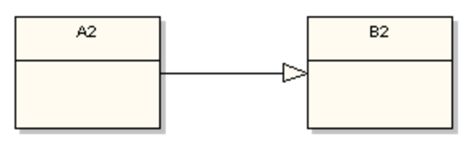
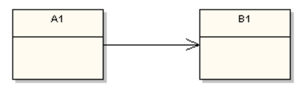

# UML 关系图

学习设计模式，首先要能看懂类与类之前的关系，否则会学得很没有安全感。

面向对象中，类与类之前的主要关系有6种，分别是：**泛化**，**实现**，**关联**，**依赖**，**聚合**，**组合**。

下面简单描述一下这6种关系的图。

### 泛化（Generalization）

其实就是**继承**，*extends*。实线 + 空心三角箭头。空心三角箭头指向父类。继承的概念就不在这里解释了。

---

### 实现（Realization）

实现一个接口（interface），*implements*。虚线 + 空心三角箭头。空心三角箭头指向接口（interface）。

---

前面2种关系简单明了，基本没有什么难以辨别的。下面4个就比较绕了，需要具体问题具体分析。

### 依赖（Dependency）

上图中，虚线 + 箭头 的形式，A指向B。我觉得加入 **依赖** 这个词后反而不太好理解。说A依赖B，其实就是 **A中有B**，比如，A中的某个方法需要B的对象作为参数或局部变量。甚至是B的对象作为A的成员变量存在。

---

### 关联（Association）

**关联** 其实也是一种依赖关系，只是这种依赖关系比前面说的 **依赖** 要强。图中，把**依赖**关系的虚线改成了实现。B通常作为A的成员变量出现。大概感受一下，成员变量的关系比方法的参数或是局部变量要强。

单向关联带有一个箭头，双向关联可以带2个箭头，也可以不带箭头。

还有一种自关联，也是就箭头指向自己。

---

### 聚合（Aggregation）

空心菱形 + 实线 + 箭头。聚合就是*has-a*的关系（感觉**关联**也具备这种关系）。其表现形式跟 **关联** 一样，都是成员变量。图中表示 **A1中有B1**。也就是说，B1的对象是A1的成员变量。

---

### 组合（Composition）

实心菱形 + 实线 + 箭头。表示*contains-a*的关系。其关联程度比 **聚合** 要高。图中表示 **A1中有B1**。也就是说，B1的对象是A1的成员变量。

---

以上4种关系不是很好区分，他们的关系强度是依次变强的：

>  依赖 < 关联 < 聚合 < 组合

---

- 图片盗自 https://vaughnvernon.co/?page_id=31
